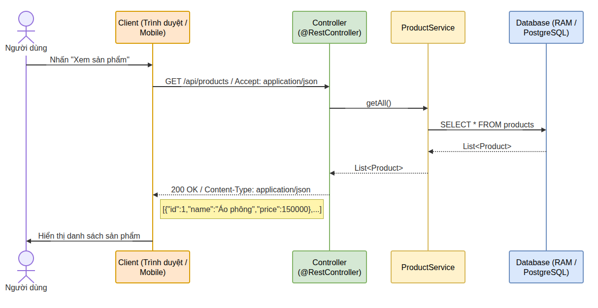
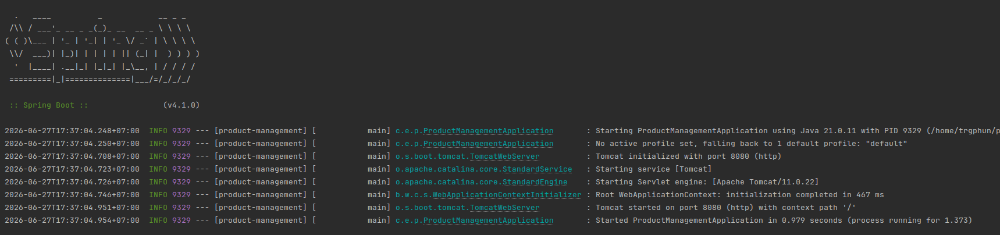
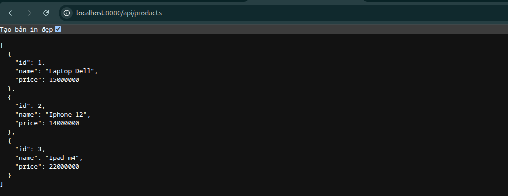

# Product Management

## Exercise 01: Data Flow trong mô hình Web

### Hình minh họa



### Thành phần tham gia

- **Người dùng**: thao tác trên giao diện.
- **Client**: trình duyệt web hoặc ứng dụng mobile.
- **Controller**: nhận request từ client, thường là `@RestController`.
- **Service**: xử lý nghiệp vụ, ví dụ `ProductService`.
- **Database**: nơi lưu trữ dữ liệu, có thể là RAM hoặc PostgreSQL.

### Luồng dữ liệu

1. Người dùng nhấn chức năng **"Xem sản phẩm"** trên giao diện.
2. Client gửi request đến server:

   ```http
   GET /api/products
   Accept: application/json
   ```

3. `Controller` nhận request và chuyển sang `Service`.
4. `Service` gọi tầng truy xuất dữ liệu để lấy danh sách sản phẩm.
5. Database thực thi truy vấn, ví dụ:

   ```sql
   SELECT * FROM products;
   ```

6. Database trả về dữ liệu dạng danh sách, ví dụ `List<Product>`.
7. `Service` trả dữ liệu về `Controller`.
8. `Controller` serialize dữ liệu thành JSON và trả response:

   ```http
   200 OK
   Content-Type: application/json
   ```

9. Client nhận JSON và hiển thị danh sách sản phẩm cho người dùng.

### Sơ đồ tổng quát

```text
Người dùng -> Client -> Controller -> Service -> Database
Người dùng <- Client <- Controller <- Service <- Database
```

### Ý nghĩa của mô hình

- **Controller** chỉ xử lý request/response.
- **Service** chứa logic nghiệp vụ.
- **Database** chỉ tập trung lưu trữ và truy vấn dữ liệu.
- Cách tách lớp này giúp code dễ bảo trì, dễ mở rộng và dễ kiểm thử hơn.

### Ví dụ dữ liệu trả về

```json
[
  { "id": 1, "name": "Áo phông", "price": 150000 },
  { "id": 2, "name": "Quần jean", "price": 320000 }
]
```
---
## Exercise 02: Khởi tạo dự án Spring Boot với Spring Initializr

Dự án đã được khởi tạo từ Spring Initializr và khởi chạy thành công.


---
## Exercise 03: Thiết kế Model và áp dụng Dependency Injection (DI)

Cơ chế Dependency Injection (DI) và Inversion of Controll (IoC) được triển khai thông qua các annotation `@Component`, `@Service`, `@Autowire`.
2 bean được khởi tạo: 
- ProductController: 
```java
@RestController
public class ProductController {}
```
- ProductService:
```java
@Service
public class ProductServiceImpl implements IProductService {} 
```
---
## Exercise 04: Xây dựng API lấy danh sách sản phẩm (GET)

API `getAllProducts` được xây dựng bằng cách định nghĩa annotation `@GetMapping(/api/products)` với `/api/products` là path để truy cập.
```java
@RestController
public class ProductController {

    @Autowired
    private IProductService productService;

    @GetMapping("/api/products")
    public List<Product> getAllProducts() {
        return productService.getAllProducts();
    }
}
``` 
- Hàm `getAllProducts` trả về `List<Product>`.
- Jackson convert `List<Product>` -> Json.

Sau khi khởi động Spring boot, truy cập vào url `http://localhost:8080/api/products` để lấy danh sách sản phầm.

---
## Exercise 05: Hoàn thiện các thao tác CRUD
Nâng cấp `ProductService` và `ProductController` để thêm các chức năng:
- Thêm mới: Method POST - `/api/products` (Nhận JSON product và thêm vào List).
- Cập nhật: Method PUT - `/api/products/{id}` (Tìm product theo ID và sửa thông tin).
- Xóa: Method DELETE - `/api/products/{id}` (Xóa product khỏi List).

`ProductController`:
```java
@RestController
@RequestMapping("/api/products")
public class ProductController {

    @Autowired
    private IProductService productService;

    @GetMapping
    public List<Product> getAllProducts() {
        return productService.getAllProducts();
    }

    @PostMapping
    public Product saveProduct(@RequestBody Product product) {
        return productService.saveProduct(product);
    }

    @PutMapping("/{id}")
    public Product updateProduct(
            @PathVariable int id,
            @RequestBody Product product) {
        return productService.updateProduct(product);
    }

    @DeleteMapping("/{id}")
    public void deleteProduct(@PathVariable int id) {
        productService.deleteProduct(id);
    }
}
```
`ProductService`:
```java
    @Override
    public Product saveProduct(Product product) {
        products.add(product);
        return product;
    }

    @Override
    public Product updateProduct(Product product) {
        for (Product p : products) {
            if (p.getId() == product.getId()) {
                products.remove(p);
                products.add(product);
                return product;
            }
        }
        return null;
    }

    @Override
    public void deleteProduct(int id) {
        for (Product p : products) {
            if (p.getId() == id) {
                products.remove(p);
            }
        }
    }
```
